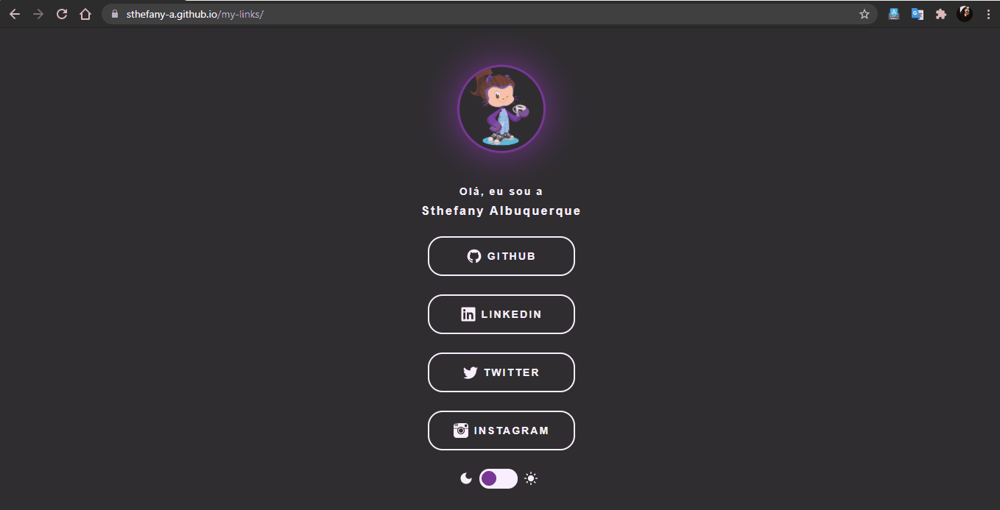
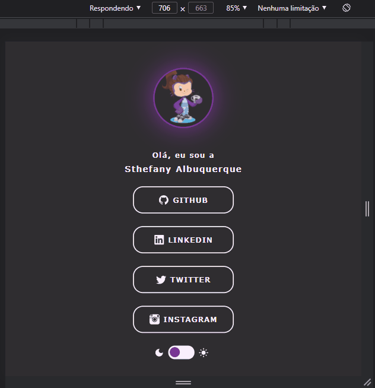

<h1 align="center"> Meu Linktree Personalizado </h1>

## :pushpin: Sobre

O Linktree é uma plataforma de social-linking e redes sociais que opera num modelo freemium (mas também oferece uma assinatura 'Pro'), seu objetivo é fornecer uma página única (ou mesmo landing page), onde qualquer pessoas ou empresas consigam disponibilizar os seus diversos links (seja para suas redes sociais ou qualquer outro endereço de destino), em um mesmo lugar.

Levando em conta as poucas opções de personalização (sem uma assinatura Pro ativa), decidi criar o meu próprio linktree para ter mais liberdade em personalizar. 

## :woman_technologist: Tecnologias e ferramentas utilizadas

- HTML
- CSS
- Javascript 
- Visual Code Studio
- ScreenToGif (para fazer os gifs de demonstração)

## :mag: Funcionalidades

✔️ Layout Responsívo 
✔️ Dark and light mode theme toggle 

## :gear: Demonstração

**Deploy da Aplicação:**
> https://sthefany-a.github.io/my-links/

  

  

Feito com :coffee: por Sthefany Albuquerque.

